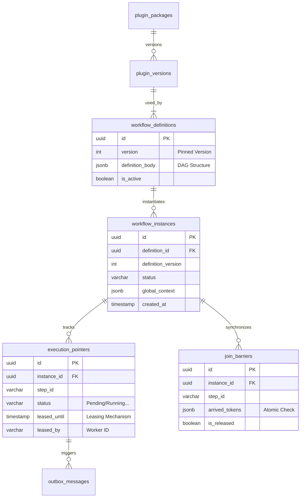

# TÀI LIỆU THIẾT KẾ CƠ SỞ DỮ LIỆU (DATABASE DESIGN DOCUMENT)

**Dự án:** .NET Distributed Automation Workflow Engine (AWE)
**Phiên bản:** 2.1 (Enterprise-Grade)
**Công nghệ:** PostgreSQL 16+ (Partitioning), Entity Framework Core 9.0 (Code-First)

---

## 1. CHIẾN LƯỢC LƯU TRỮ (STRATEGIC OVERVIEW)

* **Hybrid Model:** Kết hợp Quan hệ (Relational) cho dữ liệu cấu trúc chặt chẽ (State, Pointer) và JSONB cho dữ liệu linh động (Context, Definition).
* **Concurrency Control:** Sử dụng Optimistic Concurrency (Row Versioning) kết hợp với cơ chế **Leasing** (Time-bound Lock) tại tầng ứng dụng.
* **Partitioning:** Bảng `execution_pointers` và `outbox_messages` được phân vùng theo tháng (`created_at`) để đảm bảo hiệu năng khi dữ liệu lớn.

---

## 2. SƠ ĐỒ THỰC THỂ (ERD - LOGICAL)

---

## 3. CHI TIẾT CẤU TRÚC BẢNG (SCHEMA SPECIFICATION)

### PHẦN I: CORE ENGINE (Orchestration & State)

#### 3.1. Bảng `workflow_instances`

*Quản lý vòng đời của một quy trình.*

| Cột | Kiểu dữ liệu | Mô tả |
| --- | --- | --- |
| `id` | `UUID` (PK) | Định danh Instance. |
| `definition_id` | `UUID` (FK) | Tham chiếu đến Definition. |
| `definition_version` | `INT` | **Version Pinning:** Cố định phiên bản Definition tại thời điểm chạy. |
| `status` | `VARCHAR(20)` | `Running`, `Suspended`, `Completed`, `Failed`, `Compensating`. |
| `context_data` | `JSONB` | Dữ liệu Runtime (Variables). Lưu theo namespace `Steps[NodeId]`. |
| `created_at` | `TIMESTAMPTZ` | Thời điểm tạo. Dùng cho Partitioning. |

#### 3.2. Bảng `execution_pointers` (HOT TABLE - UPDATED)

*Lưu vết Token di chuyển. Đã cập nhật cơ chế LEASING.*

| Cột | Kiểu dữ liệu | Mô tả |
| --- | --- | --- |
| `id` | `UUID` (PK) | Định danh Token. |
| `instance_id` | `UUID` (FK) | Tham chiếu Instance cha. |
| `step_id` | `VARCHAR(100)` | ID của Node hiện tại trong đồ thị. |
| `status` | `VARCHAR(20)` | `Pending`, `Running`, `Completed`, `Failed`, `Skipped`. |
| `active` | `BOOLEAN` | Cờ báo hiệu pointer này còn sống hay không. |
| `leased_until` | `TIMESTAMPTZ` | **(NEW)** Thời điểm Lease hết hạn. Dùng để detect Zombie Worker. |
| `leased_by` | `VARCHAR(100)` | **(NEW)** ID/IP của Worker đang giữ Lease. |
| `retry_count` | `INT` | Số lần đã retry. Default = 0. |
| `predecessor_id` | `UUID` | Pointer cha (Dùng để truy vết ngược - Backtracking). |
| `scope` | `JSONB` | Mảng `BranchId` để phân biệt các nhánh song song. |

* **Index quan trọng:** `CREATE INDEX idx_pointer_poll ON execution_pointers (created_at) WHERE status = 'Pending' AND (leased_until IS NULL OR leased_until < NOW())` -> *Giúp Worker tìm việc cực nhanh.*

#### 3.3. Bảng `join_barriers` (NEW - FOR ATOMIC JOIN)

*Hỗ trợ thuật toán Double-Check Locking cho các Node Join.*

| Cột | Kiểu dữ liệu | Mô tả |
| --- | --- | --- |
| `id` | `UUID` (PK) |  |
| `instance_id` | `UUID` (FK) |  |
| `step_id` | `VARCHAR(100)` | ID của Node Join. |
| `required_count` | `INT` | Số lượng nhánh cần thiết để kích hoạt. |
| `arrived_tokens` | `JSONB` | Danh sách ID các Pointer đã đến (Tránh race condition đếm trùng). |
| `is_released` | `BOOLEAN` | `true` nếu Join đã hoàn tất và sinh ra Pointer tiếp theo. |

#### 3.4. Bảng `outbox_messages`

*Đảm bảo Transactional Outbox Pattern.*

| Cột | Kiểu dữ liệu | Mô tả |
| --- | --- | --- |
| `id` | `BIGINT` (PK) | Identity (Tự tăng). |
| `correlation_id` | `UUID` | ID của Instance hoặc Pointer liên quan. |
| `message_type` | `VARCHAR` | Tên Class của Event/Command. |
| `payload` | `JSONB` | Nội dung Message serialize. |
| `created_at` | `TIMESTAMPTZ` | Thời điểm tạo. |
| `processed_at` | `TIMESTAMPTZ` | Thời điểm đã gửi sang RabbitMQ thành công (NULL = chưa gửi). |

---

### PHẦN II: PLUGIN ECOSYSTEM (Extension)

#### 3.5. Bảng `plugin_packages` & `plugin_versions`

*Quản lý Metadata cho hệ thống Plugin Dynamic Loading (.NET ALC).*

| Bảng | Cột | Kiểu | Mô tả |
| --- | --- | --- | --- |
| **`plugin_packages`** | `id` | `UUID` |  |
|  | `unique_name` | `VARCHAR` | VD: `AWE.HttpPlugin` (Unique). |
|  | `display_name` | `VARCHAR` | Tên hiển thị trên UI Designer. |
| **`plugin_versions`** | `id` | `UUID` |  |
|  | `package_id` | `UUID` |  |
|  | `version` | `VARCHAR` | Semantic Versioning (1.0.0). |
|  | `assembly_path` | `VARCHAR` | Đường dẫn vật lý file DLL (để ALC load). |
|  | `config_schema` | `JSONB` | JSON Schema để Frontend render form cấu hình. |

---

## 4. CÁC THAY ĐỔI SO VỚI BẢN V1.0

1. **Thêm Leasing Fields:** Đã thêm `leased_until`, `leased_by` trực tiếp vào bảng `execution_pointers`. Điều này giúp truy vấn "tìm việc" (Polling) và "quét lỗi" (Recovery) nằm trên cùng 1 bảng -> Hiệu năng cao hơn.
2. **Thêm Bảng `join_barriers`:** Để hiện thực hóa yêu cầu "Atomic Join Barrier" trong SRS. Thay vì đếm `COUNT(*)` trên bảng pointer (dễ sai khi concurrency cao), chúng ta dùng bảng này để chốt trạng thái (Latch).
3. **JSONB Context:** Khẳng định việc lưu context theo cấu trúc `Steps[NodeId]` ngay trong thiết kế DB.

---

Bản thiết kế này đã hoàn toàn khớp với kiến trúc **"Monolith First - Aspire Orchestrated"** và đáp ứng mọi yêu cầu khắt khe của SRS Enterprise. Bạn có thể đưa thẳng vào báo cáo đồ án.