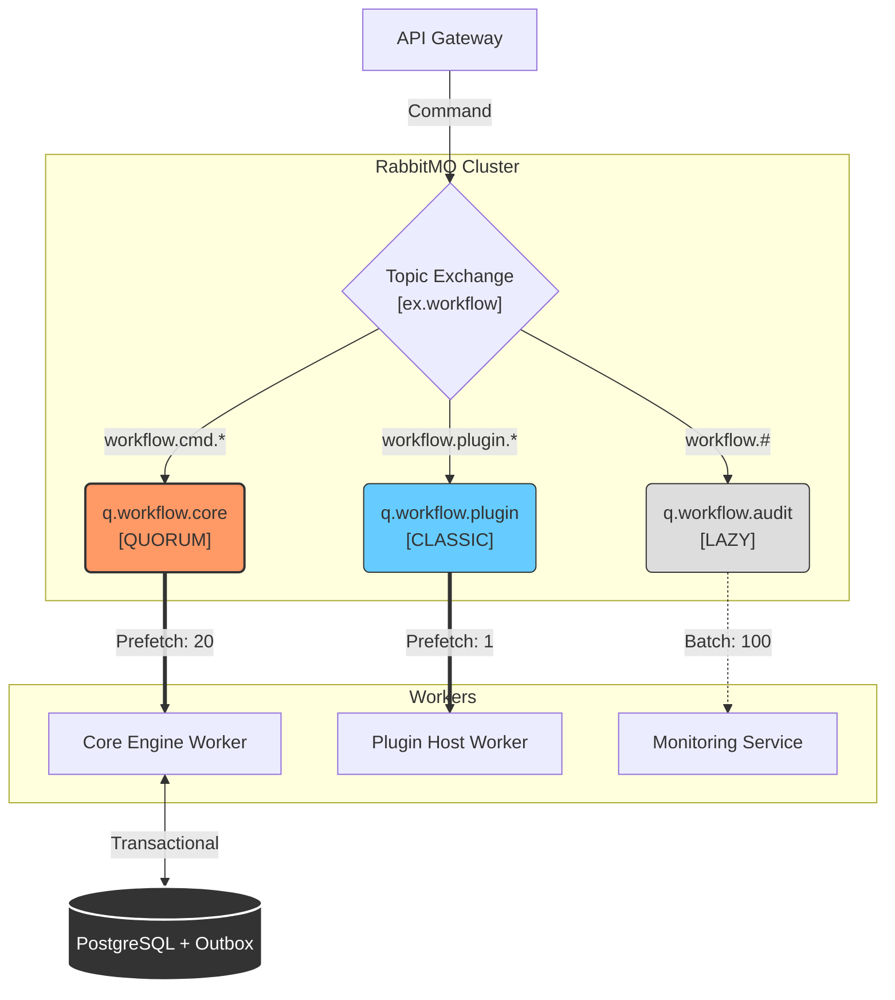

# 📘 MASTER ARCHITECTURE SPEC: MESSAGING INFRASTRUCTURE

| Metadata | Details |
| --- | --- |
| **Project** | Scalable Workflow Automation Platform (AWE) |
| **Component** | Messaging Backbone (RabbitMQ & MassTransit) |
| **Version** | 1.0.0 (Production Ready) |
| **Status** | **APPROVED** |
| **Context** | .NET Aspire, Modular Monolith, Event-Driven |

---

## 1. 🌐 System Overview (Tổng quan hệ thống)

Hệ thống sử dụng mô hình **Decoupled Architecture** với RabbitMQ làm trung tâm điều phối. Chiến lược cốt lõi là **Workload Isolation** (Cô lập tải) để đảm bảo Core Engine không bao giờ bị tắc nghẽn bởi các tác vụ ngoại vi.

### 1.1 Architecture Diagram

---

## 2. 🏗️ Infrastructure Layer (Cấu hình Hạ tầng)

*Áp dụng tại: `src/AWE.AppHost` & Docker*

| Tham số | Giá trị Cấu hình | Yêu cầu Kỹ thuật (Rationale) |
| --- | --- | --- |
| **Image** | `rabbitmq:3-management` | Cần UI Management Plugin để giám sát. |
| **Volume Binding** | **`rabbitmq-data:/var/lib/rabbitmq`** | **CRITICAL:** Dữ liệu phải tồn tại sau khi container restart. |
| **VHost** | `/awe-system` | Cô lập môi trường, không dùng default `/`. |
| **Resource Limit** | `vm_memory_high_watermark: 0.7` | Chặn Publisher khi RAM > 70% để tránh Crash. |
| **Ports** | `5672` (AMQP), `15672` (UI) | Standard ports. |

---

## 3. 🛣️ Topology Strategy (Chiến lược Định tuyến)

*Áp dụng tại: MassTransit Configuration*

### 3.1 Exchange

* **Name:** `ex.workflow`
* **Type:** `Topic`
* **Durability:** `Durable`

### 3.2 Queues & Isolation (Chiến lược Hàng đợi)

| Queue Name | Type | Routing Key | Mục đích & Đặc tính |
| --- | --- | --- | --- |
| **`q.workflow.core`** | **Quorum** | `workflow.cmd.*` | **High Criticality.** Chứa lệnh Core. Replicated data, an toàn tuyệt đối, chấp nhận chậm hơn Classic một chút. |
| **`q.workflow.plugin`** | **Classic** | `workflow.plugin.*` | **High Latency.** Chứa tác vụ Plugin nặng. Tách riêng để không block Core. |
| **`q.workflow.audit`** | **Classic (Lazy)** | `workflow.#` | **High Volume.** Chứa Log/Metrics. Lưu trên đĩa để tiết kiệm RAM server. |
| **`q.workflow.error`** | Classic | N/A | **Dead Letter Queue (DLQ).** Nơi chứa message chết sau khi hết lượt Retry. |

---

## 4. 🛡️ Reliability & Data Consistency (Độ tin cậy)

*Áp dụng tại: `src/AWE.Infrastructure` (DbContext) & `src/AWE.Worker*`

Sử dụng mô hình **Exactly-Once Processing** (về mặt logic) thông qua Outbox/Inbox pattern.

### 4.1 Transactional Outbox (Sender Side)

* **Công nghệ:** `MassTransit.EntityFrameworkCore`.
* **Cơ chế:** Message **KHÔNG** được gửi ngay lập tức.
1. Mở Transaction DB.
2. Lưu Business Data (Workflow State).
3. Lưu Message vào bảng `OutboxMessage`.
4. Commit Transaction.
5. Process ngầm (Relay) tự động đọc bảng Outbox và đẩy sang RabbitMQ.

### 4.2 Idempotency / Inbox (Receiver Side)

* **Công nghệ:** `MassTransit.EntityFrameworkCore` (Inbox Pattern).
* **Cơ chế:** Worker tự động kiểm tra `MessageId` trong bảng `InboxState`.
* **Hành động:** Nếu MessageId đã tồn tại (đã xử lý) -> **Bỏ qua (Ack)** ngay lập tức.

### 4.3 Message Durability

* **Persistent:** `true` (Lưu message xuống đĩa cứng của RabbitMQ).

---

## 5. 🚀 Performance Tuning (Hiệu năng Consumer)

*Áp dụng tại: Code đăng ký Consumer trong Worker*

| Consumer Group | Prefetch Count | Concurrency Limit | Giải thích Chiến lược |
| --- | --- | --- | --- |
| **Core Workflow** | `20` | `20` | Logic CPU-bound nhẹ. Tối ưu throughput cao. |
| **Plugin Execution** | **`1`** | `1` - `5` | Logic I/O-bound nặng. Tránh **Head-of-line blocking** (1 task nặng làm tắc 19 task nhẹ). |
| **Audit/Logging** | `100` | `50` | Ghi log batch xuống DB. Cần gom lô lớn. |

---

## 6. 🔄 Resilience & Error Handling (Xử lý lỗi)

### 6.1 Retry Policies (Chính sách thử lại)

1. **Transient Error (Lỗi mạng/DB lock):**
* *Interval:* Immediate (50ms, 100ms, 200ms).
* *Target:* Mọi Consumer.

2. **External Service Error (Plugin/API):**
* *Interval:* Exponential Backoff (1s, 2s, 5s, 10s).
* *Jitter:* +/- 100ms (Tránh retry đồng loạt đánh sập 3rd party).
* *Target:* Plugin Worker.

### 6.2 Dead Letter Strategy (Nghĩa địa)

* **Trigger:** Khi Message hết số lần Retry quy định.
* **Action:** Di chuyển Message sang queue `_error` (VD: `q.workflow.core_error`).
* **Quy tắc:** Tuyệt đối **KHÔNG** Auto-retry từ DLQ. Phải có người (Dev) kiểm tra và Re-queue thủ công.

---

## 7. 📝 Conventions & Standards (Quy chuẩn)

* **Message Format:** `JSON`.
* **Namespace:** `AWE.Contracts.Messages`.
* **Naming Convention:**
* Queue: Kebab-case (`submit-workflow-command`).
* Class: PascalCase (`SubmitWorkflowCommand`).

* **Interface:** Sử dụng `record` C# cho tính bất biến (immutability).

---

## 8. ✅ Implementation Checklist (Các bước thực hiện)

Dùng danh sách này để đánh dấu tiến độ setup:

* [ ] **Step 1 (Infra):** Config `AWE.AppHost` (RabbitMQ Container + Volume).
* [ ] **Step 2 (DB):** Config `DbContext` (Add Inbox/Outbox Entities) & Migration.
* [ ] **Step 3 (Shared):** Config `AWE.ServiceDefaults` (Add MassTransit, Serializer, OpenTelemetry).
* [ ] **Step 4 (Worker):** Config `AWE.Worker` (Add EntityFrameworkOutbox, Setup Endpoints & Prefetch).
* [ ] **Step 5 (Contracts):** Define Command/Event records in `AWE.Contracts`.
* [ ] **Step 6 (Logic):** Implement Consumers with `WorkflowDbContext`.

---

*Document generated for AWE Project Architecture Team.*

> ⚠️ MỘT VÀI ĐIỂM CẦN LƯU Ý

Mặc dù thiết kế đã rất tốt, nhưng trong quá trình vận hành thực tế (Day-2 Operations), bạn nên chú ý thêm 2 điểm này:

1. Vấn đề "Poison Message" trong Inbox:

Khi dùng UseInbox (Idempotency), MassTransit sẽ lưu ID tin nhắn đã xử lý vào bảng InboxState.

Vấn đề: Bảng này sẽ phình to rất nhanh theo thời gian (hàng triệu dòng/ngày).

Giải pháp: Bạn cần một Background Job (CronJob) chạy định kỳ (vd: mỗi tuần) để xóa các dòng InboxState cũ quá 30 ngày. MassTransit có hỗ trợ config DuplicateDetectionWindow, nhưng dọn dẹp DB vẫn là việc cần làm.

2. Giám sát độ trễ (Consumer Lag):

Thiết kế tốt nhưng nếu Plugin chạy quá chậm, hàng đợi q.workflow.plugin sẽ đầy lên.

Giải pháp: Cần setup Prometheus/Grafana (như trong mô hình bạn vẽ có Monitoring Service) để alert khi hàng đợi > 1000 tin nhắn.