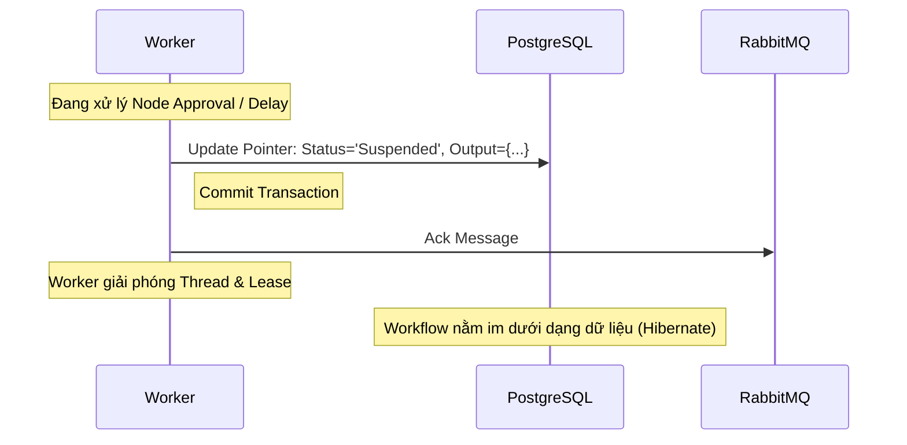
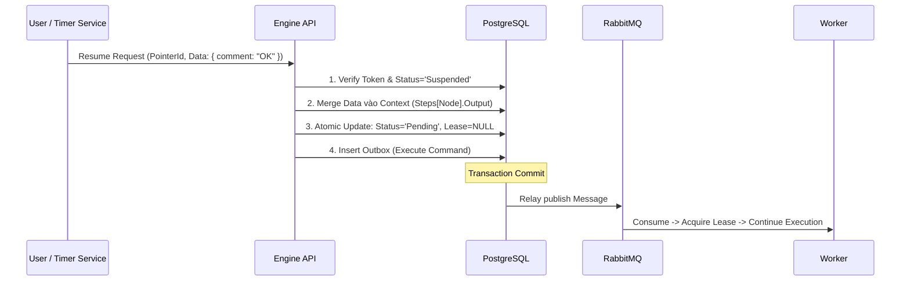

## **6.1 Suspend & Hibernate (Tạm dừng và Ngủ đông Workflow)**

Khi workflow gặp các Node yêu cầu chờ đợi (Approval, Delay, External Signal), Engine sẽ **tạm dừng hoàn toàn việc thực thi** và đưa luồng vào trạng thái “ngủ đông” (hibernate).

### **Nguyên tắc cốt lõi**

* Không giữ Thread (Zero-blocking).
* Không giữ Timer (Dùng Quartz/Hangfire ngoại vi).
* Không giữ Message trong Queue (Ack ngay khi Suspend).
* Trạng thái workflow **chỉ tồn tại trong Database**.

---

### **6.1.1 Sequence – Suspend / Hibernate**



---

### **6.1.2 Đặc tả hành vi Suspend**

Khi `ExecutionPointer` chuyển sang trạng thái **Suspended**:

* Message trong Queue bị tiêu thụ (Ack) hoàn toàn.
* Worker kết thúc nhiệm vụ, trả thread về Pool.
* **Lease được giải phóng** (hoặc hết hạn tự nhiên).
* Context được lưu incremental vào Database.

---

## **6.2 Resume Workflow (Đánh thức luồng xử lý)**

Workflow chỉ được tiếp tục khi có **tác động ngoại vi hợp lệ**.

---

### **6.2.1 Sequence – Resume (Updated with Data Merge)**

*Lưu ý: API đóng vai trò như Engine, phải xử lý dữ liệu đầu vào (VD: Lời nhắn phê duyệt) trước khi gọi Worker.*



---

### **6.2.2 Atomic Resume & Idempotency (CRITICAL UPDATE)**

Việc Resume phải đảm bảo tính nguyên tử và **Reset Lease** để tránh trường hợp Pointer bị kẹt bởi "bóng ma" của Worker cũ.

```sql
UPDATE execution_pointers
SET 
    status = 'Pending',
    leased_until = NULL,      -- Quan trọng: Xóa Lease cũ
    leased_by = NULL,         -- Quan trọng: Cho phép Worker bất kỳ nhận việc
    updated_at = NOW()
WHERE 
    id = @PointerId 
    AND status = 'Suspended'; -- Optimistic Concurrency Control

```

* Nếu `RowCount == 0` → Resume thất bại (Token không tồn tại hoặc không ở trạng thái chờ).
* Nếu `RowCount == 1` → Thành công, Message được bắn vào Queue.

---

## **6.3 Approval Token (Human-in-the-Loop Control)**

Đối với các bước có sự can thiệp của con người, hệ thống sử dụng **ApprovalToken** để đảm bảo bảo mật và tính nhất quán.

### **6.3.1 Cấu trúc ApprovalToken**

| Field | Mô tả |
| --- | --- |
| `id` | UUID duy nhất. |
| `execution_pointer_id` | Pointer đang chờ. |
| `expired_at` | Thời hạn hiệu lực (TTL). |
| `status` | Active / Used / Expired. |
| `claimed_by` | UserID của người thực hiện (Audit). |

---

### **6.3.2 Nguyên tắc One-time Use**

* Mỗi ApprovalToken chỉ được sử dụng **một lần duy nhất**.
* Flow xử lý tại API:
1. Check `ApprovalTokens` where `Token == Input` AND `Status == Active`.
2. Nếu không hợp lệ → 400 Bad Request.
3. Nếu hợp lệ → Đánh dấu `Used`.
4. Thực hiện logic **Resume Workflow** (Mục 6.2).


---

## **6.4 Delay vs Approval – Phân biệt rõ trách nhiệm**

| Cơ chế | Nguồn Resume | Cách kích hoạt |
| --- | --- | --- |
| **Delay** | Hệ thống | **Timer Job** (Quartz/Hangfire) gọi API Resume khi đến giờ. |
| **Approval** | Con người | **User** gọi API Resume thông qua UI hoặc Email Link. |

---

## **6.5 Đặc tính Enterprise được đảm bảo**

1. **Zero-Resource Waiting:** Hàng nghìn Workflow có thể "đợi" cùng lúc mà không tốn 1 byte RAM nào cho Thread xử lý.
2. **Context Injection:** Dữ liệu từ người dùng (Input Form khi duyệt) được merge an toàn vào luồng xử lý.
3. **Zombie-Proof:** Logic Resume reset luôn `Lease`, đảm bảo dù Worker cũ có chết hay sống thì Worker mới vẫn nhận được việc ngay lập tức.

---