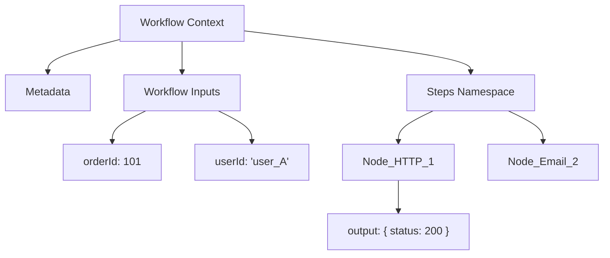
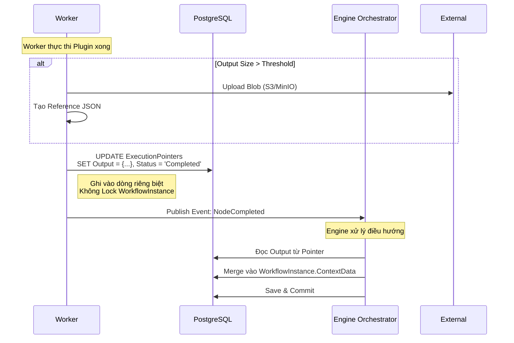

# **7. CONTEXT MANAGEMENT & VARIABLE RESOLUTION (FINAL)**

Quản lý dữ liệu thực thi (Context) là thành phần quyết định độ linh hoạt của Engine. Thiết kế này đảm bảo tính cô lập dữ liệu và hiệu năng cao trong môi trường xử lý song song.

---

## **7.1 Context Model & Namespace Isolation**

### **7.1.1 Mô hình Context phân tầng**

Context không lưu dạng phẳng mà chia thành các vùng cách ly (Namespace) để tránh xung đột.

### **7.1.2 Định nghĩa vai trò**

* **Workflow Inputs (`Inputs`):** Dữ liệu đầu vào khi khởi tạo Workflow (Read-only).
* **Step Outputs (`Steps[NodeId]`):**
* Mỗi Node chỉ ghi dữ liệu vào vùng của chính nó.
* Dữ liệu này là **Immutable** (Bất biến) sau khi Node hoàn thành.

### **7.1.3 Quy tắc bất biến (Invariant)**

> **Engine là thực thể DUY NHẤT có quyền cập nhật Global Context.**

* **Worker:** Chỉ trả về kết quả (Result) gắn với `ExecutionPointer`.
* **Engine:** Chịu trách nhiệm thu gom (Aggregate) kết quả từ Pointer vào Global Context.

---

## **7.2 Context Persistence & Safe Merge Strategy**

### **7.2.1 Nguyên tắc "Zero-Contention"**

Để tránh việc các Worker khóa lẫn nhau (Database Locking) khi chạy song song:

* Worker **KHÔNG** ghi trực tiếp vào `workflow_instances`.
* Worker ghi Output vào `execution_pointers.context_item`.
* Việc Merge vào Context chung được thực hiện **bất đồng bộ** bởi Engine.

### **7.2.2 Sequence – Optimized Write Flow**

### **7.2.3 Size Control**

* **Threshold:** 1MB.
* **Offloading:** Tự động đẩy ra Blob Storage nếu vượt ngưỡng.
* **Lazy Loading:** Engine không tải Blob về, chỉ truyền Reference (`ref`) cho Worker tiếp theo. Worker tiếp theo tự tải nếu cần.

---

## **7.3 Variable Resolution ({{ }})**

### **7.3.1 Cú pháp chuẩn**

Hệ thống hỗ trợ truy xuất dữ liệu theo đường dẫn JSON (JSON Path):

* `{{workflow.input.orderId}}`
* `{{steps.CreateOrder.output.transactionId}}`
* `{{context.system.timestamp}}`

### **7.3.2 Thời điểm Resolve (Pre-dispatch)**

> **Biến được giải quyết TẠI ENGINE -> Biến thành HẰNG SỐ trước khi gửi đi.**

**Lợi ích:**

1. **Security:** Worker không cần quyền đọc toàn bộ DB.
2. **Performance:** Worker không tốn CPU để parse chuỗi.
3. **Decoupling:** Plugin không phụ thuộc vào cú pháp `{{}}`.

### **7.3.3 Quy trình Resolve**

1. Engine xác định Node tiếp theo.
2. Lấy cấu hình Input của Node đó (VD: URL = `http://api.com/{{steps.A.output.id}}`).
3. Truy vấn JSON Context để lấy giá trị `123`.
4. Thay thế chuỗi: URL = `http://api.com/123`.
5. Đóng gói Message gửi Worker.

---

## **7.4 Parallel Execution Safety**

Trong mô hình Fork/Join:

1. **Worker A** ghi `Steps[A]`.
2. **Worker B** ghi `Steps[B]`.
3. Vì ghi vào 2 dòng `ExecutionPointer` khác nhau -> **Không bao giờ đụng độ (No Lock Contention)**.
4. Engine lần lượt merge A và B vào Global Context khi nhận sự kiện hoàn thành.

---

## **7.5 Các đảm bảo kiến trúc**

✔ **High Concurrency:** Hàng nghìn node song song không gây tắc nghẽn DB.
✔ **Isolation:** Lỗi dữ liệu node này không làm hỏng node kia.
✔ **Type Safety:** Engine xử lý việc convert kiểu dữ liệu (String -> Int/Bool) khi resolve biến.

---