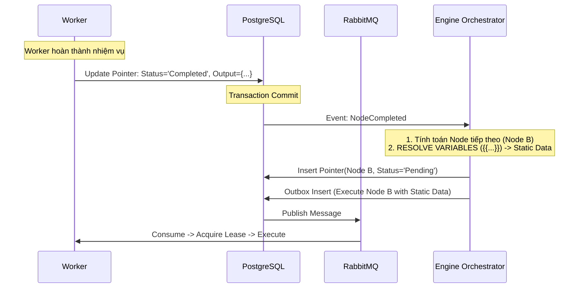
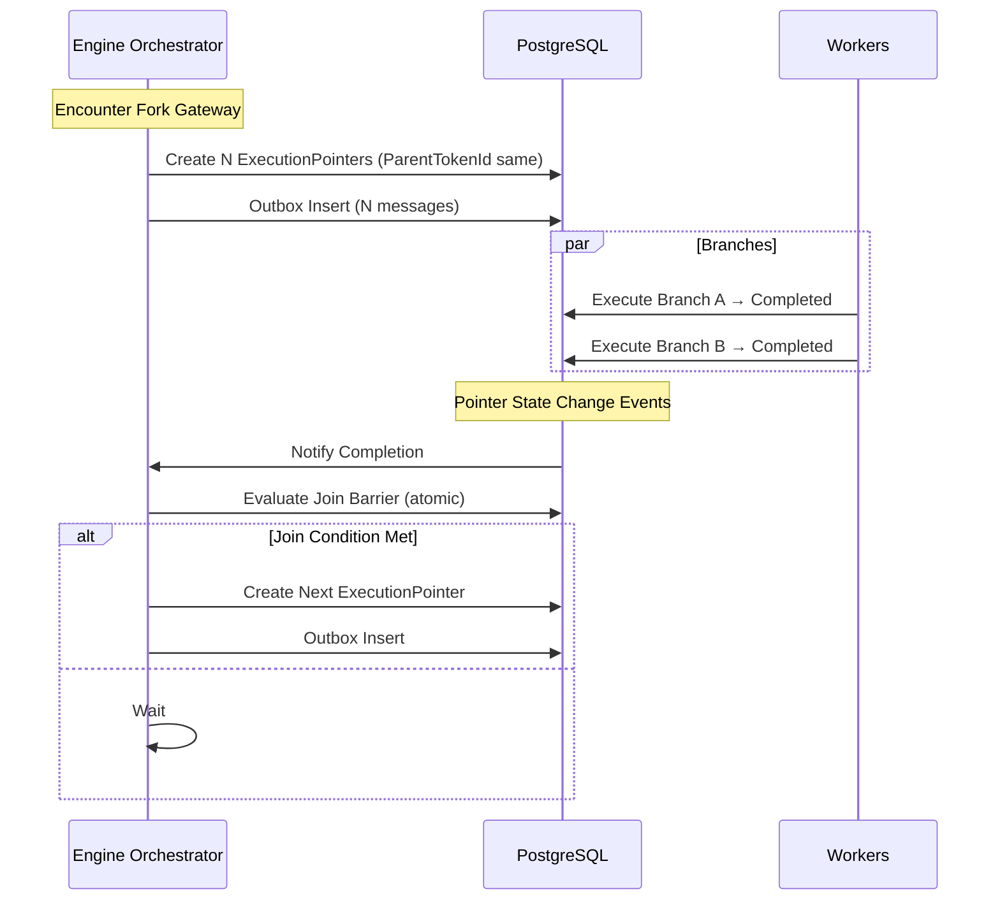

# 1️⃣ NHỮNG GÌ ĐANG ĐÚNG – GIỮ NGUYÊN

### ✅ Token-based orchestration

* Token là đơn vị di chuyển
* Fork → nhiều token
* Join → đồng bộ theo ParentTokenId
  → **Đúng “linh hồn” workflow engine**

### ✅ Static Join + Dead Path Elimination

* Join không chờ nhánh If/Else bị loại
* Tránh deadlock
  → Đây là **điểm ăn tiền của đồ án**

### ✅ Metadata Token (ParentTokenId, BranchId)

* Phân nhóm
* Cách ly context
  → Chuẩn BPMN engine (Camunda / Temporal level)

---

# 2️⃣ NHỮNG CHỖ PHẢI SỬA (RẤT QUAN TRỌNG)

## ⚠️ (1) Normal Flow: **Worker đang “ra lệnh” cho Engine**

### Vấn đề

Trong 3.1 bạn viết:

```text
W -> E: Yêu cầu kích hoạt Node kế tiếp
E -> DB: Tìm Node tiếp theo
```

❌ **Sai vai trò kiến trúc**

> Worker KHÔNG BAO GIỜ “yêu cầu” orchestration

### Chuẩn phải là

* Worker **chỉ update trạng thái**
* Engine **tự quan sát DB / Event để kích hoạt bước tiếp**

👉 Nếu không sửa, bạn sẽ vô tình thiết kế **tight coupling Worker ↔ Engine**

---

## ⚠️ (2) Fork / Join: Worker đang tham gia logic Join ❌

```mermaid
W->>DB: Lock hàng đợi Join
DB->>E: Kiểm tra đủ token chưa?
```

❌ **Worker không được tham gia Join decision**

Join là **Orchestration concern**, không phải Execution concern.

Nếu Worker quyết định Join:

* Race condition khi nhiều worker cùng tới
* Khó scale
* Sai triết lý event-driven

---

## ⚠️ (3) Join Condition: thiếu khái niệm “Join Barrier Record”

Hiện tại Join của bạn dựa vào:

```sql
COUNT(*) FROM ExecutionPointers
```

❌ Thiếu:

* Atomicity
* Lock rõ ràng
* Trạng thái Join đã fired hay chưa

👉 Cần một **Join Barrier (logical)**

---

## ⚠️ (4) TokenStatus vs ExecutionPointer.Status đang lẫn nhau

Bạn dùng:

* `TokenStatus`
* `ExecutionPointer.Status`

👉 Thực tế:

* **Token không cần status**
* **ExecutionPointer chính là token runtime**

Cần thống nhất để tránh code rối.

---

# 3️⃣ PHIÊN BẢN ĐÃ SỬA – CHUẨN ENGINE CORE

## ✅ 3.1 Normal Flow (FIXED)

<!-- ```mermaid
sequenceDiagram
    participant W as Worker
    participant DB as PostgreSQL
    participant MQ as RabbitMQ
    participant E as Engine Orchestrator

    W->>DB: Update ExecutionPointer(Node A) = Completed
    Note over DB: Transaction Commit

    DB->>E: WorkflowStateChanged Event
    E->>DB: Resolve Next Nodes (Node B)
    E->>DB: Create ExecutionPointer(Node B, Pending)
    E->>DB: Outbox Insert (Execute Node B)

    DB->>MQ: Publish Message
    MQ->>W: Consume Message (Node B)
``` -->


👉 Worker **không gọi Engine**

---

## ✅ 3.2 Fork / Join (ARCHITECTURALLY CORRECT)



---

## ✅ 3.3 Join Barrier (PHẢI CÓ)

### Logical Model

```text
JoinBarrier
- workflow_instance_id
- join_node_id
- parent_token_id
- expected_tokens
- arrived_tokens
- dead_tokens
- fired (bool)
```

### Join Condition (Atomic)

```sql
-- Logic "Dead Path Elimination"
-- TotalArrived bao gồm cả những token chạy thành công VÀ những token bị bỏ qua
arrived_tokens_count = (count_completed + count_skipped)

IF (arrived_tokens_count >= expected_tokens) AND (fired = false) THEN
    -- Kích hoạt bước tiếp theo
    SET fired = true
    INSERT NextPointer...
END IF
```

👉 Khi fire:

* set `fired = true`
* sinh node tiếp theo **một lần duy nhất**

---

## ✅ 3.4 Token / Pointer Clarification (VERY IMPORTANT)

| Concept            | Có cần không | Ghi chú                  |
| ------------------ | ------------ | ------------------------ |
| Token entity riêng | ❌ Không      | Gộp vào ExecutionPointer |
| ExecutionPointer   | ✅ Có         | Runtime token            |
| ParentTokenId      | ✅ Có         | Join grouping            |
| BranchId           | ✅ Có         | Context isolation        |
| is_dead_path       | ✅ Có         | Join pruning             |

👉 **ExecutionPointer = Token runtime**

---

## 4️⃣ JSONB STRUCTURE (SỬA NHẸ)

```json
{
  "id": "uuid",
  "workflow_instance_id": "uuid",
  "node_id": "node_1",
  "parent_token_id": "uuid_root", // Nullable (Root không có cha)
  "branch_id": "uuid_branch",     // Scope phân nhánh
  "status": "Skipped",            // Thay vì is_dead_path: true
  "retry_count": 0,
  "leased_until": null,           // NULL = Pending (chưa ai nhận)
  "leased_by": null
}
```

---

