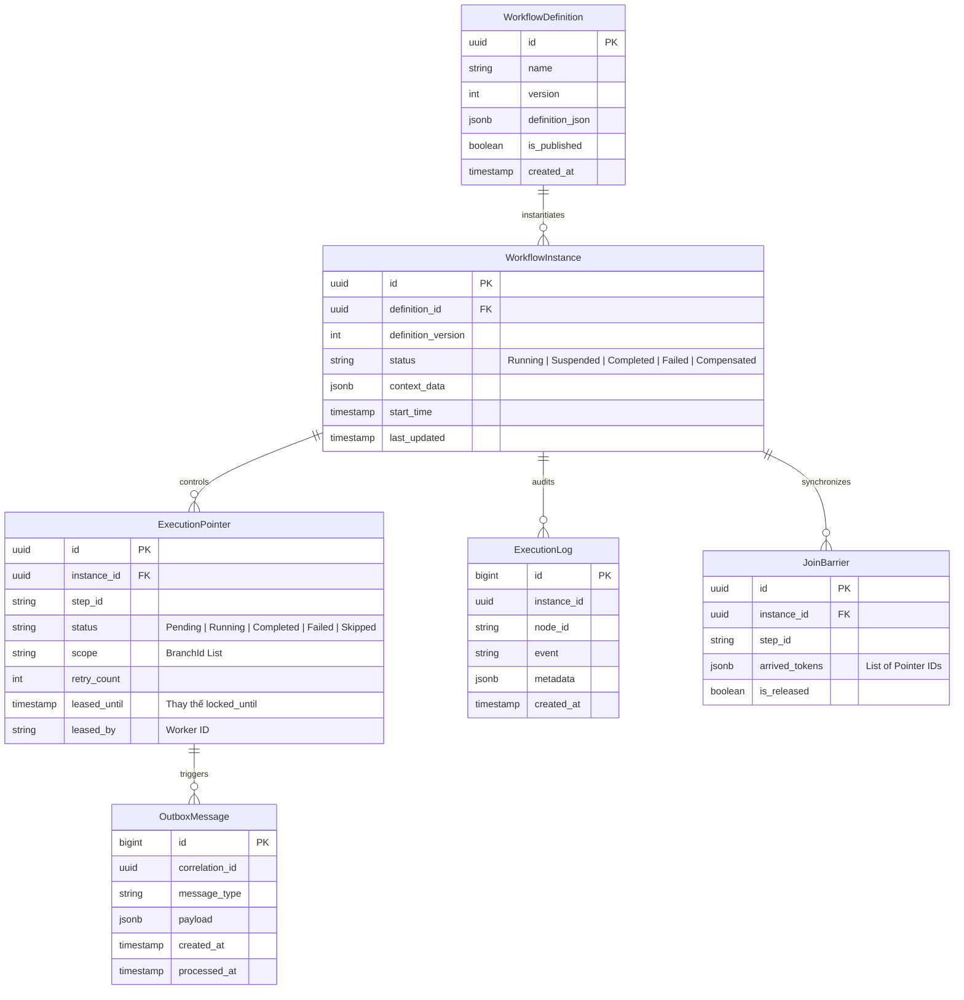
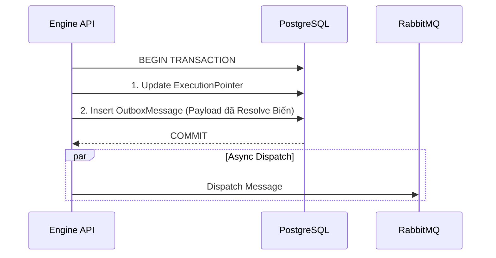
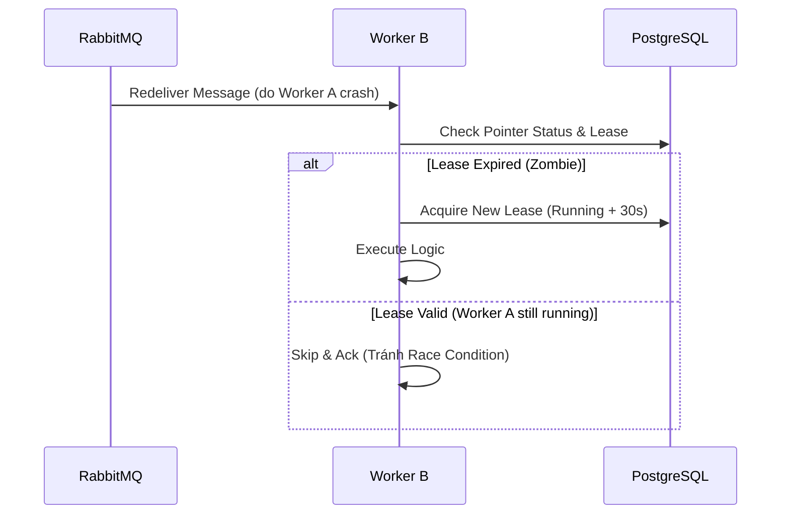

## **5.1 Core Persistence Model (ERD – Revised)**

*Cập nhật: Bổ sung `JoinBarrier` và chuẩn hóa tên cột Leasing.*

### 🔧 Điểm nâng cấp quan trọng

* **Leasing Fields:** `leased_until`, `leased_by` giúp nhận diện chính xác ai đang giữ task.
* **JoinBarrier:** Bảng phục vụ thuật toán Atomic Join.
* **Status:** Bổ sung `Skipped` và `Compensated`.

---

## **5.2 ExecutionPointer – Single Source of Truth**

> **ExecutionPointer là “Ground Truth” duy nhất của Runtime State**

### Quy tắc bất biến (Invariant):

1. **No Ghost Execution:** Một Pointer chỉ được chạy nếu có `Status=Running` và `LeasedUntil > Now`.
2. **Persistence First:** Mọi thay đổi trạng thái phải được `COMMIT` vào DB trước khi gửi sự kiện đi nơi khác.

---

## **5.3 Safe Dispatch & Transaction Boundary**

### **Nguyên tắc vàng**

> **Không có side-effect nào được phép xảy ra nếu DB chưa commit trạng thái.**

### Trình tự chuẩn:

---

## **5.4 Crash Recovery & Zombie Detection**

### **Zombie Execution Detection**

Một ExecutionPointer được coi là **Zombie** nếu:

* `status = Running`
* `leased_until < NOW()` (Hết hạn Lease)
* Không có Heartbeat mới từ Worker.

### **Chiến lược xử lý (Recovery Job)**

| Trạng thái | Hành động |
| --- | --- |
| **Pending** | Không làm gì (Đợi Worker nhận). |
| **Running + Expired Lease** | **Reset to Pending**, Clear `LeasedBy`. |
| **Completed / Skipped** | Ignore. |
| **Failed** | Áp dụng Retry Policy hoặc Manual Intervention. |

---

## **5.5 Message Redelivery & Idempotency Boundary**

---

## **5.6 Plugin Idempotency – Ranh giới trách nhiệm**

### **Engine đảm bảo**

* **At-least-once Delivery:** Đảm bảo Message đến được tay Worker.
* **Exactly-once Processing State:** Đảm bảo trạng thái trong DB chỉ chuyển đổi 1 lần duy nhất (nhờ Lease & Versioning).

### **Plugin phải đảm bảo**

* Tự xử lý Idempotency cho các tác vụ side-effect (VD: Gọi API thanh toán phải kèm `RequestId`).
* **Engine KHÔNG thể rollback side-effect bên ngoài** nếu Plugin không hỗ trợ Compensation.

---

## **5.7 Recovery After Full System Downtime**

Ngay cả khi toàn bộ cụm Server (API, Worker, MQ) bị mất điện:

1. Khi khởi động lại, Database là nguồn sự thật duy nhất.
2. **Recovery Job** quét bảng `ExecutionPointers`.
3. Tìm các pointer đang dở dang (`Running` nhưng hết hạn Lease).
4. Reset về `Pending` -> Trigger lại quy trình thực thi tự động.

👉 **Không mất dữ liệu, tự động hồi phục (Self-healing).**

---