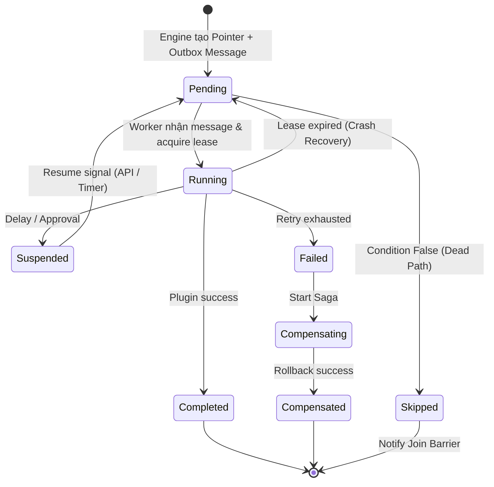

# 2. WORKFLOW RUNTIME LIFECYCLE (REVISED – ENTERPRISE GRADE)

## 2.1 ExecutionPointer State Machine (FINAL)



---

## 2.2 State Transition & Ownership (UPDATED)

| Current      | Next         | Trigger                              | Owner                   |
| ------------ | ------------ | ------------------------------------ | ----------------------- |
| None         | Pending      | Create workflow / upstream completed | **Engine API**          |
| Pending      | Running      | Worker acquire lease                 | **Worker**              |
| Pending      | Skipped      | WCondition Eval False (Engine Logic) | **Engine**              |
| Running      | Completed    | Plugin success                       | **Worker**              |
| Running      | Suspended    | Delay / Approval                     | **Worker**              |
| Running      | Pending      | Lease timeout / crash                | **Engine Recovery Job** |
| Suspended    | Pending      | Resume request                       | **Engine API**          |
| Running      | Failed       | Non-retryable or retry exhausted     | **Worker**              |
| Failed       | Compensating | Start Saga                           | **Engine**              |
| Compensating | Compensated  | All rollback done                    | **Engine**              |

---

## 2.3 Retry & Failure Classification (FIXED)

### Exception Types

```csharp
class RetryableException : Exception {}
class NonRetryableException : Exception {}
```

### Behavior

* RetryableException: MassTransit tự động Retry (Exponential Backoff).

* NonRetryableException: Chuyển trạng thái sang Failed ngay lập tức.

* Quy tắc quan trọng trước khi Retry (Idempotency):

  * Worker bắt buộc phải thực hiện lại bước Acquire Lease (Update LeasedUntil).

  * Nếu Update thất bại (do Worker khác đã nhận hoặc Lease vẫn còn hiệu lực bởi process khác) → Skip execution & Ack Message.

---

## 2.4 Suspend / Resume (Idempotent)

### Suspend

* Worker:

  * Update status = Suspended
  * Commit DB nếu có
  * Ack message (giải phóng worker)

### Resume API

```http
POST /api/workflow/resume/{pointerId}
```

**Rules:**

* Kiểm tra Status == Suspended.
* Atomic Update: Chuyển Status = Pending và reset LeasedUntil = NULL.
* Gửi lệnh thực thi vào Queue.
* Nếu request thứ 2 gửi đến (Double click) → DB check thấy Status != Suspended → Trả về 200 OK (Idempotent) nhưng không làm gì cả.

---

## 2.5 Compensation (Saga – Crash Safe)

### Flow

1. Pointer chuyển sang `Failed`
2. Engine phát hiện, chuyển sang trạng thái instance sang **Compensating**
3. Engine tính toán Compensation Plan (Danh sách các node cần rollback theo thứ tự ngược).
4. Tạo ExecutionPointer mới cho các bước bù trừ (Action = Compensate).
5. Sau khi xong:

   * Instance Status → Compensated (Đã xử lý xong hậu quả).
   * (Không để là Failed, để phân biệt với lỗi hệ thống chưa được xử lý).

### Crash Handling

* Nếu hệ thống crash khi đang Compensating:
  * Khi khởi động lại, Recovery Job quét thấy Instance đang Compensating.
  * Nó sẽ tiếp tục tạo Pointer cho các bước rollback chưa hoàn thành.
