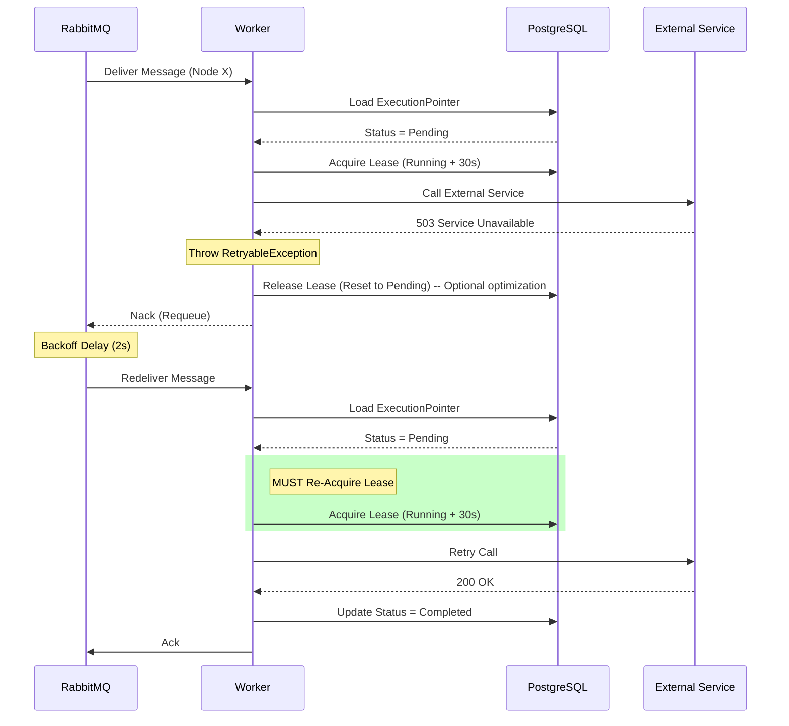
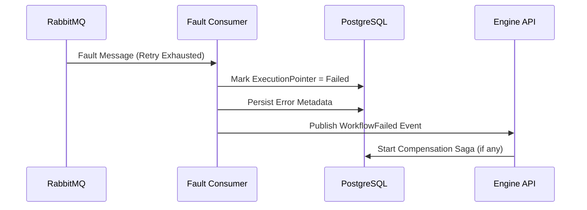
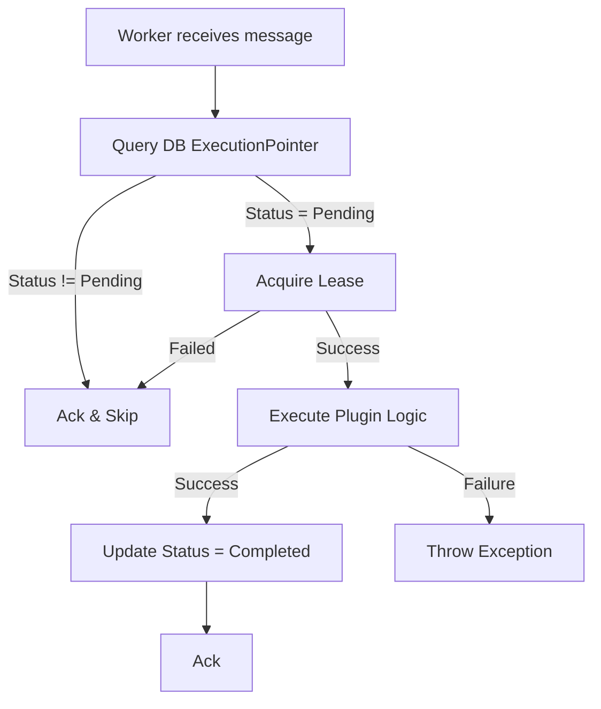
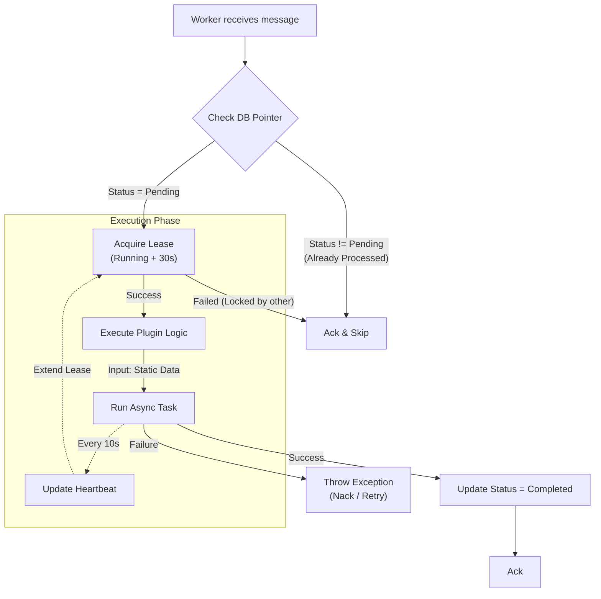

# 4. RETRY – FAILURE – IDEMPOTENCY (REVISED)

## 4.1 Sequence – Retry thành công (Transient Fault)

---

## 4.2 Retry Exhausted → Failure (FIXED RESPONSIBILITY)

👉 **Worker không tham gia bước này**

---

## 4.3 Idempotency Flow (Correct Order)
- graph v1

- graph v2 

---

## 4.4 Idempotency Guarantees (FINAL)

| Scenario            | Protection      |
| ------------------- | --------------- |
| Duplicate message   | DB status check |
| Parallel workers    | Lease + status  |
| Crash while running | Lease timeout   |
| Retry after success | Idempotent skip |
| Resume double click | Status guard    |
| Data consistency    |  Pre-dispatch Resolution (Engine side) |

