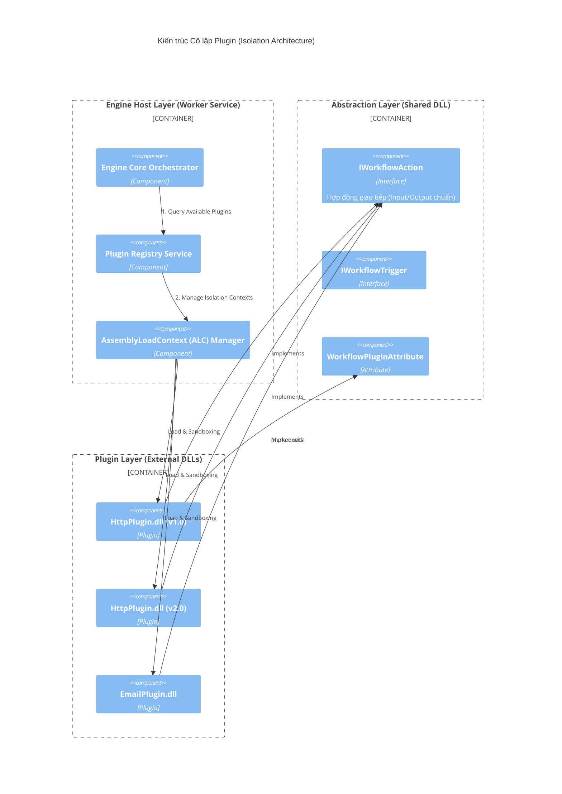
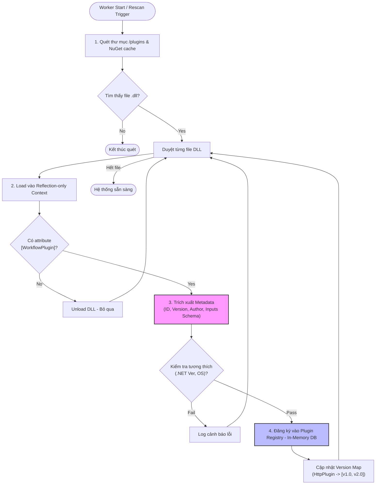

Để trực quan hóa phần **C. HỆ THỐNG PLUGIN & KHẢ NĂNG MỞ RỘNG** mà bạn đã mô tả, chúng ta cần 3 góc nhìn khác nhau để bao quát hết các khía cạnh kỹ thuật:

1. **Góc nhìn Kiến trúc (Component Diagram):** Cho thấy cấu trúc tổng thể, cách Core Engine cô lập với Plugin thông qua các "Hợp đồng" (Contracts).
2. **Góc nhìn Vòng đời (Lifecycle Diagram):** Mô tả quá trình từ lúc quét, nạp DLL cho đến khi đăng ký vào hệ thống.
3. **Góc nhìn Cấu hình Động (Dynamic UI Flow):** Minh họa cách JSON Schema biến thành giao diện và cách dữ liệu đầu vào được xử lý.

Dưới đây là 3 biểu đồ chi tiết:

---

### 1. Biểu đồ Kiến trúc Hệ thống Plugin (Plugin Architecture Overview)

Biểu đồ này thể hiện mối quan hệ giữa các thành phần chính. Điểm mấu chốt là **Core Engine không phụ thuộc trực tiếp vào Plugin cụ thể**, mà chỉ phụ thuộc vào các Interface trừu tượng.

**Giải thích:**

* **Abstraction Layer:** Đây là phần quan trọng nhất. Cả Engine và Plugin đều tham chiếu đến DLL này. Nó định nghĩa "Thế nào là một Plugin".
* **AssemblyLoadContext (ALC):** Cơ chế của .NET giúp nạp các DLL vào môi trường riêng biệt. Điều này cho phép bạn chạy đồng thời `HttpPlugin v1.0` và `v2.0` trong cùng một process mà không bị xung đột.

---

### 2. Biểu đồ Quy trình Phát hiện & Đăng ký (Discovery & Registry Lifecycle)

Biểu đồ hoạt động này mô tả những gì diễn ra khi Worker khởi động hoặc khi có lệnh quét lại thư mục plugin.

**Giải thích:**

* Quá trình này sử dụng Reflection để "nhìn" vào bên trong file DLL mà không cần thực sự thực thi code của nó, đảm bảo an toàn.
* Bước 3 và 4 là nơi hệ thống xây dựng "Danh mục" các tính năng để phục vụ cho Frontend.

---

### 3. Biểu đồ Luồng Cấu hình Động (Dynamic Configuration & Expression Flow)

Biểu đồ này kết nối Frontend (Designer) và Backend (Engine), minh họa cách "Low-code" hoạt động nhờ JSON Schema và Ngôn ngữ biểu thức.

```mermaid
sequenceDiagram
    participant FE as Frontend (React Flow)
    participant API as Engine API
    participant Reg as Plugin Registry
    participant W as Worker Engine
    participant P as Concrete Plugin (e.g., HttpAction)

    note over FE, Reg: Giai đoạn Thiết kế (Design Time)
    FE->>API: Get Plugin Schema (PluginID: "HttpRequest")
    API->>Reg: Fetch Metadata & JSON Schema
    Reg-->>FE: Trả về JSON Schema
    note right of FE: { "url": "string", "method": "enum", "headers": "object" }
    
    FE->>FE: Render Form động từ Schema
    User->>FE: Nhập liệu (có dùng biến): URL = "https://api.com/users/{{userId}}"
    FE->>API: Save Workflow Definition (Lưu cấu hình thô)

    note over API, P: Giai đoạn Thực thi (Runtime)
    W->>W: Đọc Workflow Definition
    W->>W: Chuẩn bị chạy Node HTTP
    
    rect rgb(0, 0, 0)
        note right of W: Expression Resolution
        W->>W: Lấy giá trị biến 'userId' từ Context (VD: "123")
        W->>W: Thay thế chuỗi: "https://api.com/users/123"
    end
    
    W->>P: ExecuteAsync(Resolved Inputs)
    P->>P: Thực hiện HTTP Call thật
    P-->>W: Trả kết quả (Outputs)

```

**Giải thích:**

* **Design Time:** Frontend hoàn toàn không biết trước về Plugin. Nó chỉ nhận JSON Schema và vẽ ra Form tương ứng.
* **Runtime:** Trước khi gọi Plugin, Engine phải làm nhiệm vụ "thông dịch viên" - giải quyết các biến `{{...}}` thành dữ liệu thật. Plugin luôn nhận được dữ liệu "sạch".